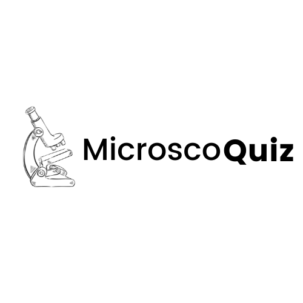

# MicroscoQuiz
<!--
*** Thanks for checking out the Best-README-Template. If you have a suggestion
*** that would make this better, please fork the repo and create a pull request
*** or simply open an issue with the tag "enhancement".
*** Thanks again! Now go create something AMAZING! :D
-->


<!-- PROJECT SHIELDS -->
<!--
*** I'm using markdown "reference style" links for readability.
*** Reference links are enclosed in brackets [ ] instead of parentheses ( ).
*** See the bottom of this document for the declaration of the reference variables
*** for contributors-url, forks-url, etc. This is an optional, concise syntax you may use.
*** https://www.markdownguide.org/basic-syntax/#reference-style-links
-->
![Python][python-shield]
[![MIT License][license-shield]][license-url]
[![LinkedIn][linkedin-shield]][linkedin-url]
![jquery-url][jquery]


<!-- PROJECT LOGO -->
<br />
<p align="center">
  <a href="https://github.com/othneildrew/Best-README-Template">
    
  </a>

  <h3 align="center" style="font-weight:bold">MicroscoQuiz app is an easy and funny way to learn by practice</h3>

  <p align="center">
    <span style="font-weight:bold; font-style:italic">Based on real world microscopic observations from CELL IMAGE LIBRARY </span> 
    <br /><br>
    <a href="http://www.cellimagelibrary.org/home"><strong>Explore CELL IMAGE LIBRARY »</strong></a><br>
    <br />
    <br />

  </p>
</p>


<!-- TABLE OF CONTENTS -->
<details open="open">
  <summary>Table of Contents</summary>
  <ol>
    <li>
      <a href="#about-the-project">About The Project</a>
      <ul>
        <li><a href="#built-with">Built With</a></li>
      </ul>
    </li>
    <li>
      <a href="#getting-started">Getting Started</a>
      <ul>
        <li><a href="#clone">Clone the repo</a></li>
        <li><a href="#Installation">Installation</a></li>
      </ul>
    </li>
</details>


<!-- ABOUT THE PROJECT -->
## About The Project
Microscoquiz app is mainly developped with Django. It is a web application that allows the users to improve their biological background by answering quizes. 
Based on microscopy image identification and biological subject.
The user has the choice to select the desired quiz (recognizing types of microscopy - several levels, recognizing the
levels, recognizing the presented cell type and the presented organelles).
The information for the images is retrieved from the Cell Image Library website. 

### Built With

* [Django](https://www.djangoproject.com/)
* [Bootstrap](https://getbootstrap.com/)
* [jQuery](https://jquery.com/)


<!-- GETTING STARTED -->
## Getting Started

To get a local copy up and running follow these simple steps

### 1. <span id="clone">Clone the repo</span>  
* Clone the repository locally

  ```sh
  git clone https://github.com/LouaiKB/MicroscoQuiz.git
  
  cd MicroscoQuiz
  ```

### 2. <span id="Installation">Installation</span>

* Install all the dependencies with ``pipenv``. If you don't have pipenv install it using
   ```sh
   pip install pipenv
   ```
* Now install all dependencies:
   ```sh
    pipenv install 
   ```
### 3. Start the app
   ```sh
   cd quizapp/

   python manage.py runserver
   ```


<!-- CONTRIBUTING -->
## Contributing

Contributions are what make the open source community such an amazing place to be learn, inspire, and create. Any contributions you make are **greatly appreciated**.

1. Fork the Project
2. Create your Feature Branch (`git checkout -b feature/AmazingFeature`)
3. Commit your Changes (`git commit -m 'Add some AmazingFeature'`)
4. Push to the Branch (`git push origin feature/AmazingFeature`)
5. Open a Pull Request


<!-- LICENSE -->
## License

Distributed under the MIT License. See `LICENSE` for more information.


<!-- CONTACT -->
## Contact


Project Link: [https://github.com/LouaiKB/MicroscoQuiz](https://github.com/LouaiKB/MicroscoQuiz)


<!-- MARKDOWN LINKS & IMAGES -->
<!-- https://www.markdownguide.org/basic-syntax/#reference-style-links -->
[python-shield]:https://img.shields.io/badge/Python-3.7-blue?style=for-the-badge&logo=python
[license-shield]: https://img.shields.io/badge/django-3.0.3-blue?style=for-the-badge&logo=django
[license-url]: https://www.djangoproject.com/
[linkedin-shield]:https://img.shields.io/badge/Bootstrap-4-blue?style=for-the-badge&logo=bootstrap
[linkedin-url]: https://getbootstrap.com/
[jquery]: https://img.shields.io/badge/jquery-blue?style=for-the-badge&logo=jquery
[jquery-url]: https://jquery.com/
[product-screenshot]: images/screenshot.png